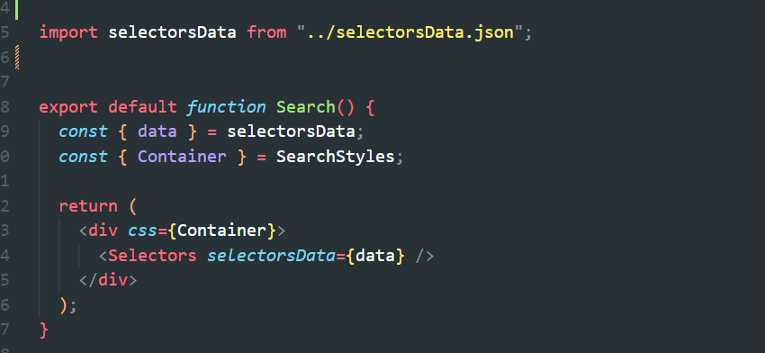

프론트엔드 개발자는 UI를 보고 객체 형태로 데이터를 추상화 한다.
객체 형태로 된 데이터 조각들이 UI를 제어하는 설계기법이다.
나는 이러한 설계기법에 데이터 중심의 UI라는 이름을 붙였다.

이 설계가 필요한 이유는 장기적인 유지보수에 적합하며 작은 노력으로도 UI를 편하게 제어할 수 있다는 장점이있다.
단점으로는 개발 시간이 오래걸리고 복잡하다. 이러한 설계를 내 개인 프로젝트에 도입해보았다.

 
 

위 모달창들을 보면 각각의 모달들은 하나씩만 열려야하는 독립적인 관계이다.
그리고 모달창을 열었을 때 체크 박스들도 하나만 체크 되어야하는 독립적 관계이다.

이러한 UI를 보았을 때 어떠한 형태로 데이터를 추상화 해야할지 생각해보자.

 

3개의 모달창들의 UI를 객체 형태로 추상화를 한 모습이다.

일단 각각의 모달들은 독립적인 관계이므로 id가 필요할 것이다. 그리고 각각의 title(채용사이트, 개발, 경력)값도 필요하다.
그리고 모달창 안의 체크박스 Text 부분과 체크했을 때의 value값 또는 초기 default 값도 있어야한다.

해당 데이터를 import 하여 Selectors 컴포넌트에 props로 전달하면 각각의 모달창들이 렌더링 되고 id값을 기반으로 각각의 모달 상태를 생성하게끔
설계하였다.

 

데이터를 각각 성별과 음식으로 바꿔주면 데이터를 기반으로 UI가 바뀐다.

 

 

## 마치며

이처럼 데이터 중심의 UI 방식이다.
데이터로 UI를 조작/제어하며 유지보수나 추가사항 등에 대처가 빠르다고 볼 수 있는 설계라고 생각이 든다.
