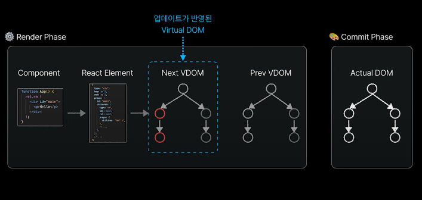

React.js의 렌더링 프로세스는 어떠한 방식으로 작동하는지? 또한 이러한 특징으로 인해 얻게 되는 장점이 무엇인지 살펴보겠습니다.

React.js의 렌더링 방식에 대해서 살펴보기 전에 브라우저의 렌더링 과정에 대해서 살펴볼 필요가 있습니다.

## 브라우저의 렌더링 방식

 

우리가 흔히 사용하는 웹 브라우저(사파리, 크롬, Edge ...등) 종류에 상관없이 모든 브라우저들은 HTML, CSS로 작성한 웹 문서들을
사용자가 보는 화면에 렌더링 시켜줍니다.

 

HTML, CSS는 크게 위 사진과 같은 절차들을 거쳐서 브라우저 화면에 렌더링(Painting) 되게 됩니다.

 

브라우저는 자기가 해석하기 편한 방식으로 HTML 코드들을 DOM Tree 형태로 변환하게 되고 CSS는 CSSOM 이라는 형태로 변환됩니다.
그렇게 생성된 DOM Tree를 바탕으로 브라우저 화면에 Layout을 잡고 Painting을 시작하게 되는 것입니다.

그렇다면 여기서 UI 업데이트는 어떻게 이루어 질까요?

예를 들어서 (사용자가 버튼을 클릭하면 모달 창이 뜸, 좋아요 버튼을 누르면 버튼 색깔이 바뀜) 이러한 상황들이 있습니다.

 

위에서 말했던 UI 업데이트들은 JavaScript가 DOM을 수정하게 되면서 발생하게 됩니다.

JavaScript의 innerHTML, appendChild, removeChild와 같은 API를 사용하여 DOM을 수정하게 되면
브라우저가 DOM의 변경을 감지하게 되어 Render Tree를 다시 만들고 Layout과 Painting 과정을 다시 반복하게 됩니다.

여기에서 중요한 것은 Layout을 잡고 Painting을 하는 과정은 브라우저에게 매우 부담이 되고 비싼 과정입니다.
그만큼 연산이 많이 필요하고 시간이 오래 걸리는 과정이죠.

 

결국 JavaScript로 DOM의 조작 횟수를 최소화 하는 것이 브라우저 성능을 끌어올리는데에 매우 중요한 부분이라고 볼 수 있습니다.
예를 들어서 UI 업데이트가 300개가 필요하다면 300번의 DOM을 수정하고 Layout과 Painting 과정이 300번 일어나게 되므로
심각한 웹 페이지의 성능 저하를 일으키게 되면서 홈페이지가 느려지는 원인이 될 수 있습니다.

## 예제코드

 

위 코드는 버튼을 눌렀을 때 ul 태그 안에 3000개의 li 태그들을 렌더링 하는 코드입니다.
3000번의 innerHTML을 실행하여 3000번의 Layout, Painting 과정이 일어납니다.

총 4.5초가 걸렸습니다.

 

위 코드는 3000개의 li 태그들을 html String 형태로 만들어 준 후 마지막 1번의 innerHTML을 실행하여
1번의 Layout, Painting 과정이 일어납니다.

총 0.013초가 걸렸습니다.

이처럼 개발자는 JavaScript로 DOM을 업데이트를 해야 될때에는 업데이트 될 것들을 다 모아서 DOM 수정 횟수를
최소한으로 가져가는 방식으로 개발을 해야합니다.

 

하지만 서비스의 규모가 커질 수록 코드는 점점 더 복잡해지기 때문에 이러한 부분들을 하나하나 개발자가 신경써서 개발을 해야되는 것은
매우 힘들 수밖에 없습니다.

순수한 자바스크립트의 힘만으로는 복잡하고 규모가 큰 서비스의 모든 업데이트들을 좋은 성능으로 처리하는 것은
굉장히 어려운 일입니다.

 

하지만 리액트는 별도의 렌더링 프로세스를 사용하기 떄문에 내부적으로 개발자가 딱히 신경쓰지 않아도 동시에 발생된 업데이트들을 모두 모아서
최소한의 횟수로 DOM을 수정할 수 있도록 해줍니다.

## React.js의 렌더링 프로세스

 

만약 개발자가 위와 같은 컴포넌트를 작성하게 되면 리액트는 해당 컴포넌트가 렌더링 하고자 하는 UI의 모든 정보들을
객체의 형태로 추상화 합니다.

 

이렇게 개발자가 작성한 모든 컴포넌트들의 UI 정보가 담긴 객체들을 모아서 가상돔(Virtural DOM)이라는
트리 형태로 구조화를 시킵니다.

여기에서 가상돔(Virtural DOM)은 실제 돔이 아닌 리액트가 내부적으로 만든 객체들의 모임이라고 생각하면 됩니다.

 

사용자의 이벤트에 의해서 업데이트가 발생하게 되면 리액트는 내부적으로 다시 컴포넌트들을 모아서 또 다른 가상돔(Virtural DOM)을 만들게 되고
전에 만들었던 가상돔과 비교하여 어떠한 부분들이 바뀌었는지 찾아냅니다.

그 후에 실제 돔에 접근하여 바뀐 부분들을 업데이트하게 됩니다.

 

리액트는 왜 이렇게 복잡한 렌더링 프로세스를 선택했던 걸까? 를 생각해보면

결국 DOM 수정 횟수를 최소화하여 대부분의 상황에서 빠른 화면 업데이트와 브라우저 성능을 좋게 가져가기 위함이라고 볼 수 있습니다.

## 총 정리

- 바닐라 자바스크립트를 이용해서 DOM을 조작할 때에는 DOM 수정을 최소화 해야함.

  - DOM 수정으로 인한 Layout, Painting 과정을 최소한으로 발생시키기 위함.
  - 동시에 발생하는 업데이트를 최대한 모아 한번만 DOM을 수정해야 함.
  - 작은 규모의 서비스는 가능하겠지만 서비스의 규모가 커질수록 쉽지 않음.
     
     

- 리액트는 자체적인 렌더링 프로세스를 사용하므로 위와 같은 걱정에서 자유롭다.
  - 가상돔(Virtural DOM) 개념을 도입하여 동시에 발생하는 업데이트를 모음.
  - 가상돔(Virtural DOM)에 반영된 모든 업데이트를 실제 돔에 한번만 반영함.
     
     

## 레퍼런스

<a href="https://youtu.be/N7qlk_GQRJU" target="_blank">👉🏻 [React.js의 렌더링 방식 살펴보기 - 이정환 | 2023 NE(O)RDINARY CONFERENCE]</a>
