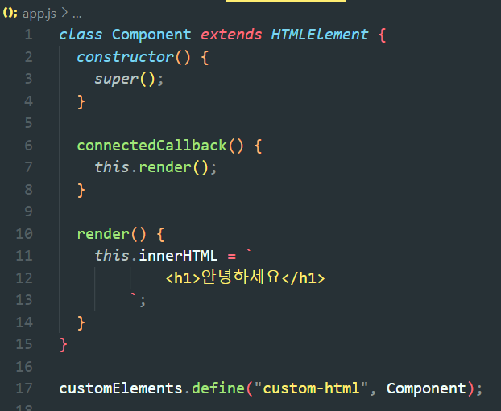
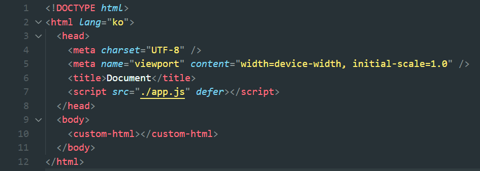
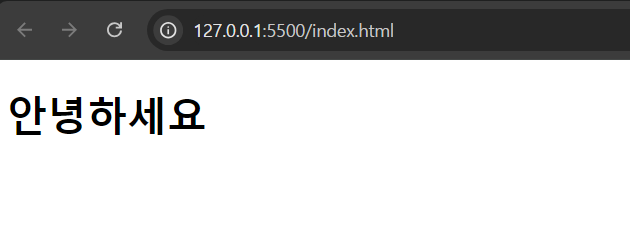
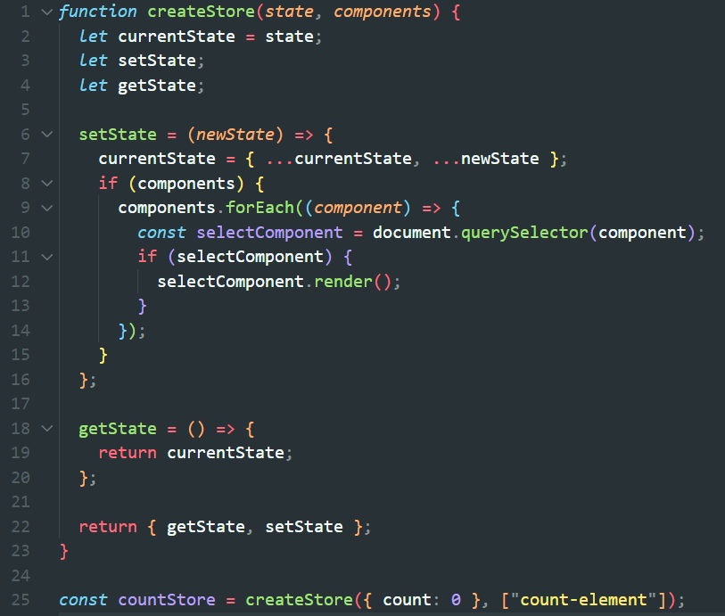
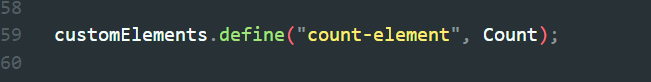
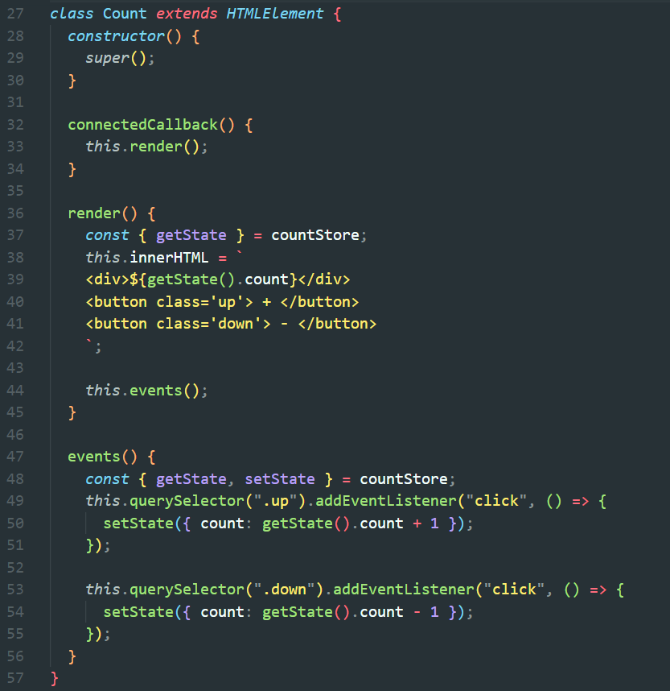
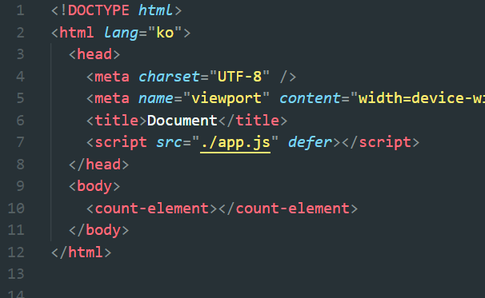
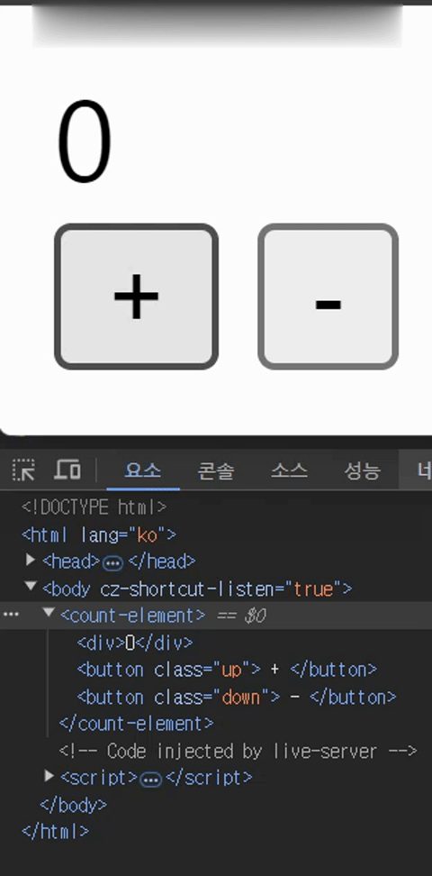

## customElements

개인적으로 뮤직 플레이어 토이 프로젝트를 진행하면서 바닐라 자바스크립트로 CSR 구현과 자바스크립트 내장 함수인 customElements API를 활용하여 HTML 템플릿 조각들을 컴포넌트 단위로 개발해 보았습니다. 여기에서 customElements가 무엇인지 살펴보겠습니다.

 

위 코드는 customElements API를 활용하여 이름을 `custom-html`이라고 정의한 컴포넌트입니다.
 
innerHTML 안에 `<h1>안녕하세요</h1>` 라는 HTML 코드조각이 렌더링 되는 구조입니다.

js 파일 내부에 class 객체를 만들어 HTMLElement를 extends 해줍니다.
여기에서 connectedCallback 함수는 해당 컴포넌트가 처음 렌더링 될때 실행됩니다.
리액트의 useEffect 함수와 흡사합니다.

 

이제 HTML 파일 내부에 방금 만든 컴포넌트를 `<custom-html></custom-html>` 형태로 넣어줍니다.

 

위 사진처럼 `안녕하세요`가 렌더링 되는 것을 볼수 있습니다.

## 상태관리

SPA를 만드는 과정에서 상태에 따라 변화되는 UI부분들을 재렌더링 해야하는 로직들이 많아질수록 코드가 복잡해지며 가독성이 매우 낮아집니다. 그래서 저는 상태관리 라이브러리들을 모방하여 저만의 상태관리 모듈을 만들어 보았습니다.

제가 만든 상태관리 모듈로 Count를 증가/감소 시키는 기능을 만들어보겠습니다.

 

createStore 함수로 첫번째 인자에는 상태값을 두번째 인자로는 상태가 변경 될때 재렌더링 될 컴포넌트의 이름을 배열의 형태로 넣어주면 객체 형태로 getState 함수와 setState 함수가 리턴됩니다.

getState 함수는 현재의 상태를 리턴해주고 setState 함수는 현재의 상태를 변경시킨 후 배열 안에 있는 컴포넌트들을 재렌더링합니다.

createStore 모듈을 사용하여 countStore를 정의해줍니다.

여기서 컴포넌트의 이름은 customElements.define으로 정의내린 String 값입니다.

 

 

이제 Count 컴포넌트 안에서 위에서 정의한 countStore를 활용하여 상태관리를 했습니다.
각각의 버튼을 클릭할 때마다 setState 함수로 count 상태를 현재의 count 상태에 +1 / -1 해줍니다.

 

마지막으로 우리가 정의내린 `count-element` 컴포넌트를 HTML 코드에 삽입합니다.

## 최종화면

 

count 상태가 변경될 때마다 `count-element` 컴포넌트는 재렌더링 되는 모습입니다.
